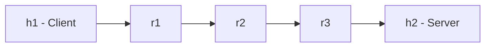
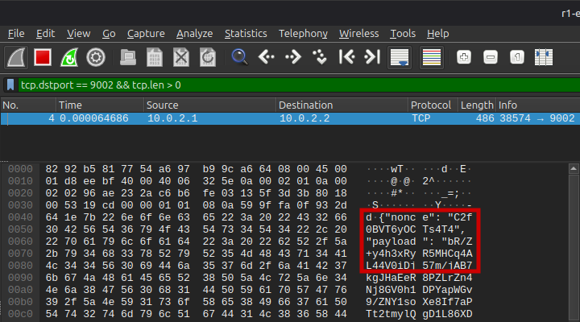
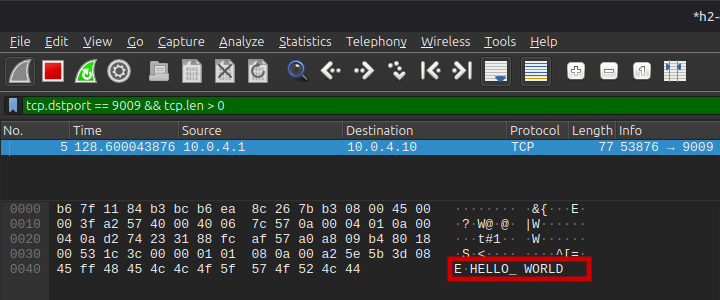

# Multi-Hop Onion Routing Network Demonstration

Python and Mininet network security project demonstrating layered encryption and multi-hop message forwarding across a simulated three-router topology.

The client wraps each message in three AES-GCM layers. Each router decrypts only its assigned layer before forwarding the remaining payload. Packet captures verify that the message remains encrypted at an intermediate hop and appears as plaintext only after the final layer is removed.

## Network Topology



## How It Works

1. `net.py` builds the Mininet topology and generates fresh 256-bit AES-GCM keys and routing data.
2. `client.py` creates a three-layer onion, with the outermost layer intended for `r1`.
3. Each router decrypts only its assigned layer and forwards the remaining onion to the next hop.
4. `r3` removes the final layer and delivers the recovered plaintext to the destination server.
5. `server.py` receives the message and returns `OK` to the client.

## Verification

### Encrypted Intermediate Hop

<p align="center">
  <a href="evidence/wireshark-encrypted-intermediate-hop.png">
    
  </a>
</p>

Traffic captured between `r1` and `r2` shows the AES-GCM `nonce` and encrypted `payload` fields. The test message `HELLO_WORLD` is not visible at this intermediate hop.

### Plaintext at the Destination

<p align="center">
  <a href="evidence/wireshark-decrypted-destination-hop.png">
    
  </a>
</p>

After `r3` removes the final encryption layer, `HELLO_WORLD` is visible in the traffic delivered to the destination server.

### Demo

[View the recorded end-to-end demonstration](evidence/onion-routing-demo.mp4)

Additional evidence is preserved under [`evidence/`](evidence/).

## Implementation

| File                         | Role                                                                                                       |
| ---------------------------- | ---------------------------------------------------------------------------------------------------------- |
| [`net.py`](net.py)           | Creates the Mininet topology, configures routing, generates per-router keys, and launches network services |
| [`onion.py`](onion.py)       | Builds the layered AES-GCM onion payload                                                                   |
| [`node.py`](node.py)         | Implements the router service used by `r1`, `r2`, and `r3`                                                 |
| [`client.py`](client.py)     | Builds and sends the onion payload and reports the server response                                         |
| [`server.py`](server.py)     | Receives the final plaintext application payload and returns `OK`                                          |
| [`settings.py`](settings.py) | Stores shared network and application configuration                                                        |

## Quickstart

Requirements include Linux, Python 3, Mininet, and `python3-cryptography`.

Install the required packages:

```bash
sudo apt update
sudo apt install mininet python3-cryptography
```

Start the topology:

```bash
sudo python3 net.py
```

From the Mininet CLI, send a message:

```bash
h1 python3 client.py --message "HELLO_WORLD"
```

A successful transmission returns:

```text
[CLIENT] elapsed ...
[CLIENT] Server reply: OK
```

For setup options and additional message workflows, see [`docs/usage.md`](docs/usage.md).

For tcpdump and Wireshark inspection procedures, see [`docs/verification.md`](docs/verification.md).

## Scope and Limitations

This project is a focused demonstration of onion-style layered encryption and multi-hop forwarding in a controlled Mininet environment. It is not an implementation of Tor or a production anonymity network.

Key limitations include:

- Route information and router keys are generated centrally by `net.py`.
- The project does not implement distributed circuit establishment or key exchange.
- Onion encryption protects the forward application payload through the router path; the server response travels back through the established proxy connections rather than through a separately onion-encrypted reverse path.
